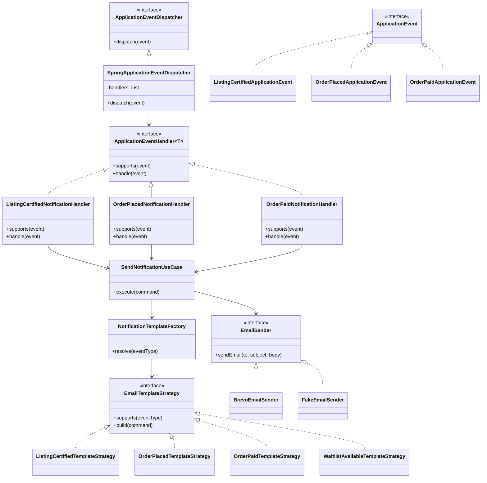
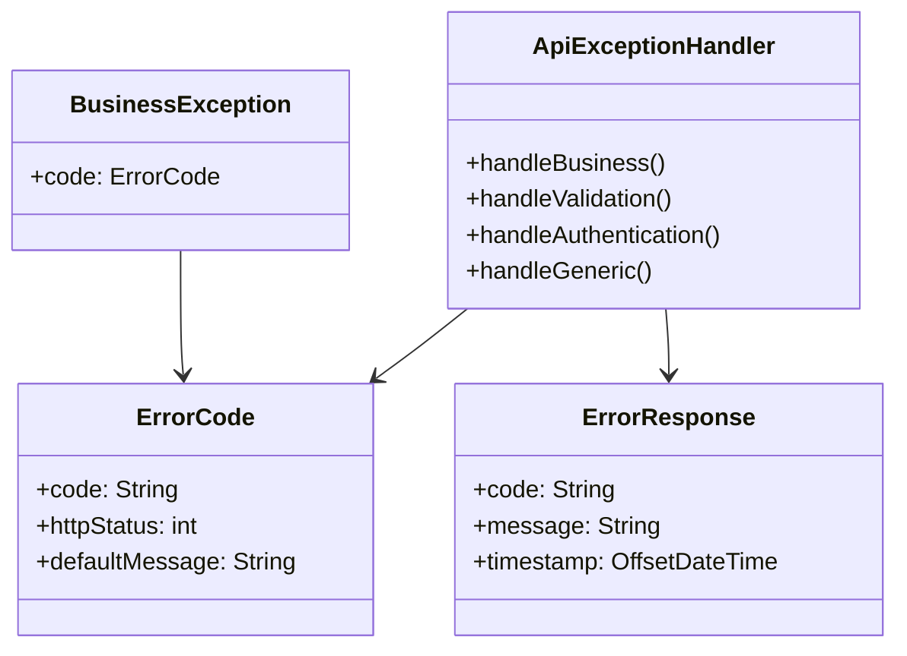
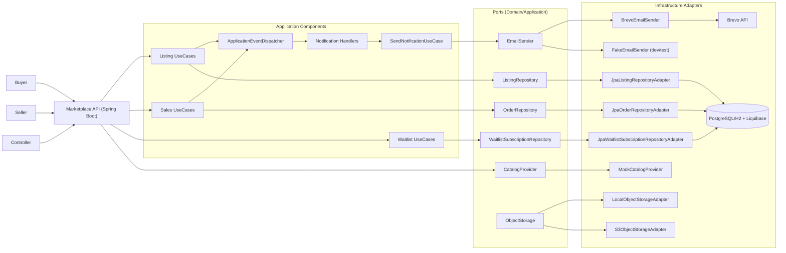

# Marketplace Revente Billets API

API REST modulaire pour revente de billets avec clean architecture, DDD, royalties, security, tests automatises, Docker/CI.

## Avancement Barème (Mises a jour progressives)

- Architecture adoptee : clean architecture + hexagonale (domaine/application/infrastructure)
- DDD en place : bounded contexts `listing`, `sales`, `catalog`, `notification`
- Contrat d'erreurs renforce par bounded context : `CAT/LST/ORD/PAY/WAI` + assertions `error.code` dans les TI
- Design patterns deja implementes :
  - creation : `NotificationTemplateFactory`
  - structurel : adapters (`Jpa...Adapter`, `BrevoEmailSender`, `FakeEmailSender`, `MockCatalogProvider`)
  - comportemental : `EmailTemplateStrategy` + `ApplicationEventDispatcher` (Observer applicatif)
- Qualite :
  - TU domaine + application
  - TI REST + security + non-regression erreurs/templates
- Infra :
  - Liquibase + seeds
  - stockage abstrait `ObjectStorage` avec switch config `storage.provider=local|s3`
  - CI GitHub Actions (`mvn clean verify` + build Docker)
  - image Docker multi-stage + `docker-compose.yml`

## Matrice barème -> preuve code

| Critere | Fichier | Preuve |
|---|---|---|
| Clean architecture / separation des couches | `marketplace-domain`, `marketplace-application`, `marketplace-infrastructure` | modules Maven separes et dependances unidirectionnelles |
| DDD (entites, aggregates, VOs, services) | `Listing`, `Order`, `Money`, `PricingBreakdown`, `AvailabilityService` | invariants metier encapsules dans le domaine |
| Pattern creation | `NotificationTemplateFactory` | resolution des strategies de template par type d'event |
| Pattern structurel (adapter) | `JpaListingRepositoryAdapter`, `JpaOrderRepositoryAdapter`, `BrevoEmailSender`, `FakeEmailSender` | ports application/domaine relies a des implementations infra |
| Pattern comportemental (observer) | `ApplicationEventDispatcher`, `*NotificationHandler`, `*ApplicationEvent` | notifications declenchees par events metier (listing certifie, order paid, waitlist available) |
| Contrat erreurs API stable | `ErrorCode`, `ApiExceptionHandler`, `SecurityConfig` | codes versionnes par contextes (`CAT/LST/ORD/PAY/WAI/AUTH`) asserts en TI |
| Tests normaux/anormaux/limites | `*IntegrationTest`, `MarkOrderPaidUseCaseTest`, tests templates | cas nominal, erreurs metier, securite, etat limite (already paid, duplicate waitlist) |
| Integration externe mail (Brevo) + mode test | `BrevoEmailSender`, `FakeEmailSender` | Brevo hors `dev/test`, fake activable via profils pour TI |
| Evolution stockage local->S3 | `ObjectStorage`, `LocalObjectStorageAdapter`, `S3ObjectStorageAdapter` | upload reel S3 (`putObject`) + URL signee (presigner), bascule par `storage.provider` |
| Piece justificative listing (stockage abstrait) | `UploadListingAttachmentUseCase`, `GenerateListingAttachmentUploadUrlUseCase`, `ObjectStorage`, `ListingController` | upload multipart + presigned URL S3 sans changer le domaine |

## EDD / Event Storming (DDD)

### Bounded Contexts

- `CATALOG`: recherche et recuperation d'evenements externes
- `LISTING`: publication et certification des billets
- `SALES`: cycle de vie de la commande et paiement
- `WAITLIST`: inscriptions des acheteurs en attente par evenement
- `NOTIFICATION`: composition et envoi des emails

### Commands -> Events -> Policies

| Commande | Evenement metier | Policy / Reaction |
|---|---|---|
| `CreateListing` | `ListingCreated` (etat aggregate) | attente certification |
| `CertifyListing` | `ListingCertifiedApplicationEvent` | email vendeur + publication marketplace |
| `CertifyListing` avec waitlist abonnee | `WaitlistTicketsAvailableApplicationEvent` | email waitlist `WAITLIST_TICKETS_AVAILABLE` |
| `PlaceOrder` | `OrderPlacedApplicationEvent` | email acheteur `ORDER_PLACED` |
| `PaymentWebhook(status=PAID)` | `OrderPaidApplicationEvent` | passage commande a `PAID` + email vendeur `ORDER_PAID` |

### Contrat templates email (HTML + texte)

| Template | Payload attendu (`data`) | Sujet |
|---|---|---|
| `LISTING_CERTIFIED` | `eventName`, `listingId` | `Votre billet est certifie` |
| `ORDER_PLACED` | `orderId`, `buyerTotal` | `Commande creee` |
| `ORDER_PAID` | `orderId`, `sellerPayout`, `platformRevenue` | `Paiement confirme` |
| `WAITLIST_TICKETS_AVAILABLE` | `eventName`, `startingPrice` | `Billets disponibles` |

Regle de validation stricte: tout payload incomplet retourne `NTF-001`.

## Diagramme de classes - Observer applicatif (Notification)



## Matrice ErrorCode par bounded context

| Bounded context | Prefixe | Exemples |
|---|---|---|
| Catalog | `CAT` | `CAT-001 EVENT_NOT_FOUND`, `CAT-002 CATALOG_PROVIDER_UNAVAILABLE` |
| Listing | `LST` | `LST-001 LISTING_NOT_FOUND`, `LST-002 LISTING_NOT_CERTIFIED`, `LST-003 LISTING_INVALID_STATE`, `LST-004 LISTING_SELLER_MISMATCH`, `LST-005 LISTING_ATTACHMENT_PRESIGN_UNAVAILABLE` |
| Order | `ORD` | `ORD-001 ORDER_NOT_FOUND`, `ORD-002 ORDER_ALREADY_PAID`, `ORD-003 ORDER_INVALID_STATE` |
| Payment | `PAY` | `PAY-001 PAYMENT_PROVIDER_ERROR`, `PAY-002 PAYMENT_WEBHOOK_INVALID` |
| Waitlist | `WAI` | `WAI-001 WAITLIST_SUBSCRIPTION_NOT_FOUND`, `WAI-002 WAITLIST_ALREADY_SUBSCRIBED` |
| Notification | `NTF` | `NTF-001 NOTIFICATION_TEMPLATE_PAYLOAD_INVALID` |

## Diagramme de classes - Contrat d'erreurs API



## C4 Component (texte/mermaid)



## Endpoints deja disponibles

- `GET /api/events/search`
- `GET /api/events/{id}`

Cas anormal couvert: indisponibilite provider catalogue -> `CAT-002`.
Cas limite couvert: webhook paiement `PAID` rejoue -> traitement idempotent (pas de notification dupliquee).
Contrat validation couvre les endpoints recents: payload/params invalides -> `GEN-001`.
Contrat securite couvre identifiants invalides -> `AUTH-002`.
- `POST /api/listings`
- `POST /api/listings/{listingId}/attachments`
- `POST /api/listings/{listingId}/attachments/presign`
- `GET /api/listings`
- `POST /api/certification/{listingId}/certify`
- `POST /api/orders`
- `GET /api/orders/{orderId}`
- `POST /api/orders/{orderId}/pay`
- `POST /api/payments/webhooks`
- `POST /api/waitlist/subscriptions`
- `DELETE /api/waitlist/subscriptions?eventId=...&userId=...`

## Security (HTTP Basic)

- seller / seller123 -> SELLER
- controller / controller123 -> CONTROLLER
- buyer / buyer123 -> BUYER

## Lancement tests

```bash
mvn test
```

