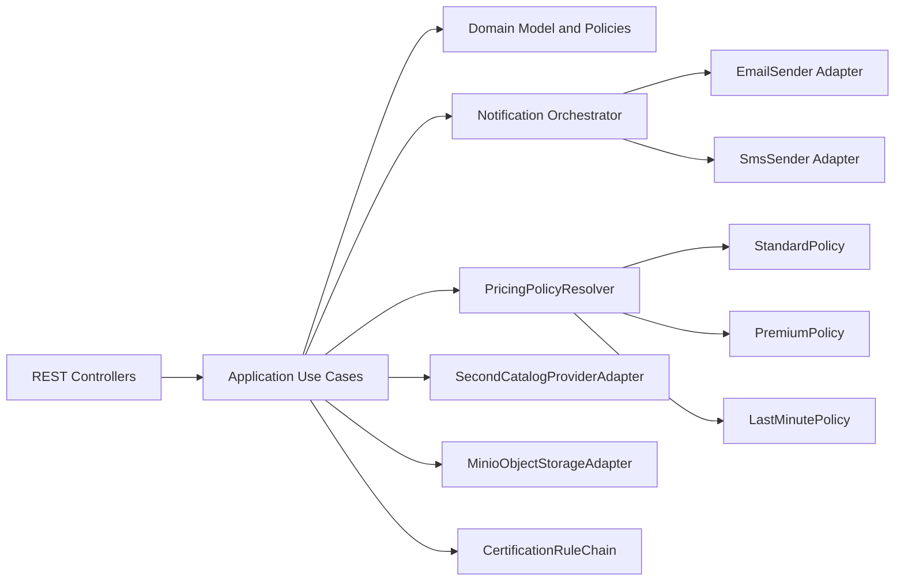

# Impact C4 previsionnel (Current -> Target)

## Intention

Montrer l'evolution architecturale sans regression des composants existants.

## Delta de composants

- Ajout `NotificationOrchestrator` (multi-canal) et `SmsSenderAdapter`.
- Ajout `PricingPolicyResolver` + strategies de pricing.
- Ajout `SecondCatalogProviderAdapter`.
- Ajout `MinioObjectStorageAdapter`.
- Ajout `CertificationRuleChain`.

## Diagramme C4 Component (target simplifie)

## Lecture barème

- Extension de comportement sans modification massive: **OCP**.
- Dependance sur des contrats metier: **DIP**.
- Responsabilites isolees par composant: **SRP**.
- Preuve de modularite et evolutivite conforme a l'attendu fil rouge.
